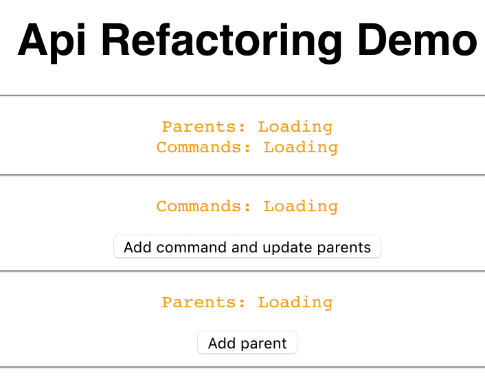

# Frontend API-handling refactoring proposal

To run this demo simply run `npm start`. The browser should open automatically, but if it doesn’t, open [http://localhost:3000](http://localhost:3000).

So, since we have discussed the loading behavior of our app, I gave it a little more thought. There are two major places where our current api handling could be improved: The interplay with actions and the fetching boilerplate.

## Areas that could be improved

### Interplay with actions

As a little recap, this is how actions trigger fetchers at the moment:

- Actions trigger refetches of the component that issued the action
- Actions trigger refetches of a parent of a component that issued the action
- Actions trigger refetches of a sibling of the component that issued the action

So far we mostly used onActionSuccess props on all fetchers to trigger the refetch. Sometimes this meant, that the success handler had to be passed through multiple components, which felt a little awkward, when you just pass it through without doint anything with it.
It gets even more complicated when an action triggers a refetch in a seemingly unrelated other component, without issuing a refetch in a common parent component. In that case we currently resort to a one-off context that will receive some kind of callback.

### Fetching boilerplate

The fetching logic itself is baked into our components. Usually in a getData method, that writes the loading state / error / data to our state.
This makes tests really hard to write since we need to mock the route params
as well as the fetch commands itself. If you are not configuring the route params in the right way, you might end up in an infinite loop without any helpful error message. I guess a lot of you spent quite some time to debug bugs like that.

If we just want to test our components, it would be nice to pass the data in directly istead of trying to mock all the requirements for the fetching logic.

## Solution proposal

I tried to tackle these problems and came up with a little demo.
It is quite flexible and supports all the current use-cases I could think of.
Essentially it is a higher order component, with these features:

- Bind multiple data fetchers to the component
- Define actions that trigger those fetchers, whenever and wherever they are called
- Provide the routeParams directly to our fetcher (no more getRouteParams)
- Define properties that are crucial for each fetcher. The fetcher will wait until these are defined.

In addition to this  HOC, I’ve created another one, that does not pass the loading state and the error state to the wrapper component, but handles these diretly by rendering a Loading or a Error component instead of the wrapped component. This HOC is currently limited to a single fetcher, since we most likely want to have more granular control over the error handling if we fetch more than one api. But since this is a common use-case I figured I also provide such a component.

### Further improvements

#### Centralize action triggers
This way an action always triggers certain fetchers without having us to define them. I am not sure if this works, since we might want to avoid refetches in certain areas. Maybe we could define a dependecy tree in a centralized state and keep the option to override them. That we you would not need to have any kowledge about the consequences of a certain action when using a fetcher.

#### Automatic props interface composition
In the proposed state we have to separate props that would come in from the HOC from ones, that can be set on the component manually. This is necessary, since we can not compute the properties generated by the HOC and exclude them for the wrapped component.

#### Improved trigger manager
The current implementation of the trigger manager is a simple component that handles subscriptions to certain actions. I think this part could see a lot of improvements. We could provide the available actions organized in multiple enums to make it easer to select specific actions, we could implement subscriptions for components that want to get notified about certain actions without the need to fetch anything (proxies would be nice … but … ie11), etc.

## The demo
The demo shows how to build an interaction across three sibling components.
This would be pretty hard to do with our current version.

### Commands component
The commands component is the simplest component of them all.
It subscribes to the `fetchEntityCommands` api method and uses `updateEntityCommands` as a trigger. The button uses `updateEntityCommands` to add a new command every time you click it. While this is pretty simple it could also be a much more complex component, which calls the update method.

### Parent component
The parent component is pretty much the same as the commands component, for `fetchEntityParents` and `updateEntityParents`. However, it has one twist: It also uses `updateEntityCommands` as a trigger, which means that it also refetches whenever the button in the commands component has been clicked.

Addinitionally this component waits for the `fetchDependecy` prop to be loaded. This will come in handy, if a parent component fetches data, that is needed for the api call. As long as this property is undefined, the component will keep its loading state.

### CommandAndParent component
This component reuses both fetchers, that we have seen so far and depends on both of them. Note that the dependencies will still be maintained. Instead of rerendering the complete component when one of the triggers is called, it only refetches the necessary data. If you click on update commands in the commands section, only the commands will update, but since the commands are also dependent on the parents, a click on the "add parents" button will trigger a refetch of both datapoints.

> Play around with the dependencies in `App.tsx` to get a feel for the HOC and their settings.

---

Thanks for reading (even if only parts of this) and let me know what you think.